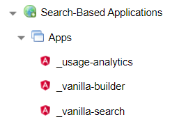

# Getting Started
{: .no_toc }

The SBA Framework is used in a variety of contexts by both technical and non-technical people. This section presents different approaches to getting started, depending on your role and overall objectives.

In this documentation, we make the assumption that you are a Sinequa customer or partner and that you can access a Sinequa server in your organization (or at the very least that you can connect to our [training server](https://vm-su-sba.sinequa.com:13343), using your provided Sinequa credentials).

1. TOC
{:toc}

## Browse sample applications and components

If you are new to Sinequa and just want to see what is on the menu, you can start by browsing our list of [sample applications](apps/apps.html).

If you want to discover new functionalities that may be useful for an existing application, have a look at the [Components](libraries/components/components.html) and [Analytics](libraries/analytics/analytics.html) libraries. You can also test most of the SBA Framework's components in the [Vanilla Builder](#vanilla-builder) application.

Sinequa also comes with pre-packaged apps (that are deployed out-of-the-box), and you can test these apps directly with your own data (See [prepackaged applications](#pre-packaged-applications) below).

## Create a first application

### Vanilla Builder

A good way to get started that does not require any developer skills is to use the [Vanilla Builder](apps/5-vanilla-builder.html) application. Vanilla Builder is a no-code tool that lets administrators customize an application by drag-and-dropping components and editing their settings, appearance and behavior.

When the customization is complete, it can be exported as a standalone application that can be [deployed](guides/4-deployment.html) independently on Sinequa.

Vanilla Builder is also a good way to discover and try out a wide range of components available in the SBA Framework without having to study the documentation and API.

### Pre-packaged applications

Another common way to get started is to copy one of the pre-packaged apps available in the [Sinequa administration](guides/2-server-config.html):



However, please note the following warnings:

⚠️ Copying the "app" object exposes a new application at the URL `<sinequa>/app/<app-name>`, but **it does not copy the application's workspace**, which contains the source code and build artifacts for the app. The new app will still be referencing the original workspace (See [server configuration](guides/2-server-config.html)).

⚠️ While it is possible to copy the workspace as well, you should carefully consider Version Control and Continuous Integration for the long-term maintainability of your project (See our [Version Control](guides/5-version-control.html) and [Updates](guides/6-updates.html) guides).

📝 To recap: Copying the "app" object is fine if you just want to customize the application's configuration and web services. However, if you copy the workspace and want to edit the source code, you must have a clear understanding of how to develop an application, which you can learn more about in the next section.

## Develop an application

SBA developers should be familiar with the following topics:

- General web development (HTML, CSS and JavaScript languages)
- The basics of the [Angular](https://angular.io/tutorial) web development framework (i.e., by completing an online tutorial)

After ensuring an understanding of these topics, new developers should use this website to become familiar with Sinequa-specific concepts. In particular:

- The [tutorial](tutorial/tutorial.html) is a good way to learn about the main Sinequa services and components. It can be completed in a few hours.
- The [architecture](guides/1-architecture.html), [development](guides/3-development.html) and [version control](guides/5-version-control.html) guides are important first reads as well.
- The [tips & tricks](tipstricks/tipstricks.html) can also answer many common beginner questions.

BUT, if you are a learn-by-doing person who doesn't read documentation if they can avoid it and you really just want to get started ***now***, then let's go:

1. Clone the repository

    ```bash
    git clone https://github.com/sinequa/sba-angular.git
    cd sba-angular
    ```

2. Install dependencies with [npm](https://www.npmjs.com/)

    ```bash
    npm install
    ```

3. Build Vanilla Search and test it using our demo server (Sinequa account required):

    ```bash
    npm run start:vanilla
    ```

    This commands is shorthand for `ng serve vanilla-search --ssl=true --proxy-config=./projects/vanilla-search/src/proxy.conf.json`. It builds the application then serves it on your computer at `https://localhost:4200`. The proxy file specifies the URL of the Sinequa server (in this case, our [demo server](https://vm-su-sba.sinequa.com:13343))

## Maintain and monitor an existing application

If you manage an existing application, you typically have to perform different tasks:

- **Monitor the usage of the application** (e.g., evaluate the adoption, the relevance of search results, the performance of the engine, read user feedback, etc.). Fortunately, *there's an app for that!* The [Usage Analytics application](apps/4-usage-analytics.html) displays all this information within a set of dashboards.

  📝 The SBA standard components and applications have a built-in audit system that records all relevant user actions into logs. These logs can be periodically indexed in an audit index. The Usage Analytics application computes metrics directly based on this data.

- **Modify the application's configuration**. Applications can be customized without changing their source code (to some extent). There are three possible ways to achieve this:

  - Customizing the configuration of the application's web services, in particular the **query web service**. This is approach is documented in the [server configuration](guides/2-server-config.html) guide.
  - Customizing the application's JSON [configuration](tipstricks/configuration.html). Each [application](apps/apps.html) has a set of internal settings that can be overriden by adding properties in the "Customization (JSON)" tab of the application. This includes typically: the list of facets, metadata, preview highlights, and it allows turning on or off certain functionalities (baskets, saved queries, etc.).
  - Customizing the application's UI with [Vanilla Builder](apps/5-vanilla-builder.html). Note that modifying the application in Vanilla Builder does not directly modify its source code. It modifies a JSON configuration describing the layout and configuration of each component. This configuration is persisted in the administrator's [User Settings](tipstricks/user-settings.html), but it can also be downloaded and reopened later for further customization.

- **Implement changes in the application code**. Making changes in the application's source code is more consequential than changes in the configuration, because there are multiple aspects to consider:

  - The versioning of the code (see the [version control](guides/5-version-control.html) guide)
  - The process of deployment (see the [deployment](guides/4-deployment.html) guide)
  - And most importantly: any change that you apply may eventually conflict with a future update and/or might necessitate future maintenance (see next point).

- **Update the SBA Framework**. Sinequa regularly [releases](releases/releases.html) new versions of the libraries and applications. These updates often introduce breaking changes:

  - Library upgrades (Angular, Bootstrap, RxJS, D3, etc.) often introduce breaking changes. So when Sinequa upgrades these libraries, the entire codebase is migrated accordingly.
  - As the SBA Framework evolves, bugs are fixed, features are added, and components & applications are refactored. These changes can be in direct conflict with how you use these components or how you customized these components.

  ⚠️ If your application is heavily customized, these updates will probably be difficult. If your customization makes use of, say, Bootstrap, you will have to follow the relevant guide from Bootstrap to migrate your code.

  Read carefully the [updates](guides/6-updates.html) guide to learn how to manage this situation, and how to be prepared by adopting [development](guides/3-development.html) and [version control](guides/5-version-control.html) best practices.

  📝 To recap: You must take the ownership of anything you customize. This includes taking the responsibility for fixing conflicts in future updates and potentially migrating your code when libraries are upgraded.
  